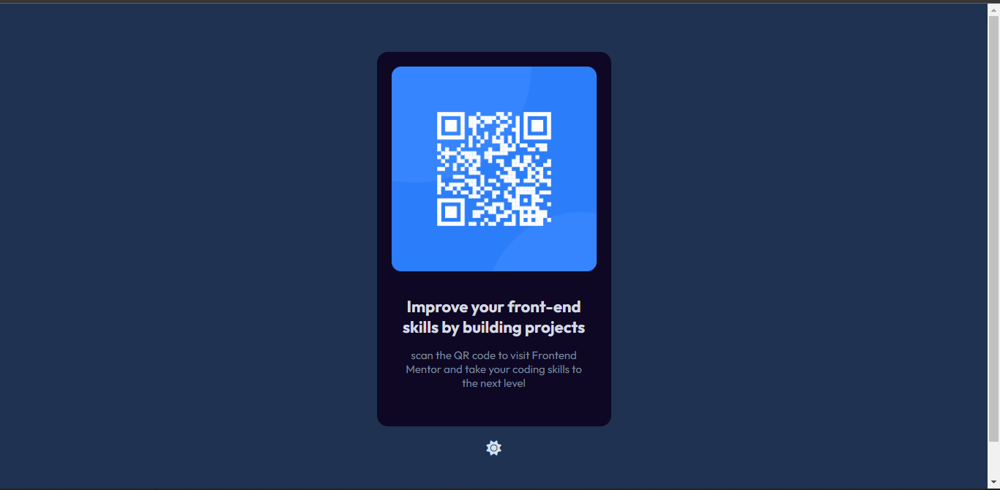
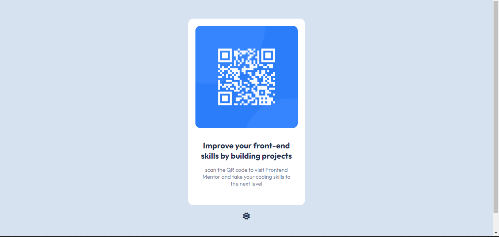

# Frontend Mentor - QR code component solution by Maame

This is a solution to the [QR code component challenge on Frontend Mentor](https://www.frontendmentor.io/challenges/qr-code-component-iux_sIO_H). Frontend Mentor challenges help you improve your coding skills by building realistic projects. 

## Table of contents

- [Overview](#overview)
  - [Screenshot](#screenshot)
  - [Links](#links)
- [My process](#my-process)
  - [Built with](#built-with)
  - [What I learned](#what-i-learned)
  - [Continued development](#continued-development)
  - [Useful resources](#useful-resources)
- [Author](#author)

## Overview
### Screenshot

 


### Links

- Solution URL: [Maame's QR code solution](https://github.com/mbonamensa/fem_qr-code)
- Live Site URL: [Frontend Mentor | QR code by Maame](https://mbonamensa.github.io/fem_qr-code)
- Figma file: [I created my own figma file](https://www.figma.com/file/iZPmhdkrsSZKRICZgXoHge/Frontend-Mentor---QR-code-design?node-id=0%3A1)

## My process

### Built with

- HTML5
- SASS
- JavaScript
- Mobile-first workflow

### What I learned

Working on this project helped me practice SASS. I have been using regular CSS for a long time and I decided to give SASS a try because I had seen it so many times. It is a much simpler way of writing CSS and I think I built this project much faster than I would have with regular CSS. The main learning highlight for me in this project was using mixins to check for the user theme preference. See code below.


```css
@mixin darkmode {
    @if (darkmode) {
        @media (prefers-color-scheme: dark) {
            @content
        }
    }    
}
```
You can find more details on how I used this in my SASS file in this repository. Dark mode wasn't included in the project but I decided to include that as a stretch goal. Also because I LOVE all my apps in dark mode.

***This is an update:*** So after submitting my project, I had errors in my HTML and decided to ask the Frontend Mentor community for help and I learnt about how accessibility isn't all about passing validation tests. I also realised the button I used for toggling the light and dark mode(a Font Awesome icon in an ```<i>``` tag which I added an event listener to) wasn't exacltly accessible so I went with a suggestion someone made which I found really useful - Wrapping a ```<button>``` tag around it and adding an ```aria-label``` attribute that describes what the button does. I used CSS to remove the button style to still maintain the aesthetics of the icon I wanted and added the event listener to the button instead. See code below:

```html
    <button title="toggle dark or light mode" aria-label="toggle dark or light mode">
      <i class="fa-solid fa-sun"></i>
    </button>
```

### Continued development

I'd want to learn more about using SASS in building projects. Especially conditionals. I don't think I'll be going back to regular CSS anytime soon. LOL.


### Useful resources

These resources were useful in helping me build this project

- [A Simple Sass Mixin for Detecting System Dark Mode](https://medium.com/@cooperwfloyd/a-simple-sass-mixin-for-detecting-system-dark-mode-bd8157bca72e) 
- [How to Watch for System Dark Mode Changes Using JavaScript and CSS](https://www.section.io/engineering-education/watch-for-system-dark-mode-using-js-css/) 
- [Using aria-label best practices](https://www.aditus.io/aria/aria-label/)
- [What is aria-label and how should I use it?](https://stackoverflow.com/questions/22039910/what-is-aria-label-and-how-should-i-use-it)


## Author

- Website - [Maame Yaa Serwaa Bona-Mensa](https://mbonamensa.netlify.app)
- Frontend Mentor - [@mbonamensa](https://www.frontendmentor.io/profile/mbonamensa)
- Twitter - [@mys_bm](https://www.twitter.com/mys_bm)
